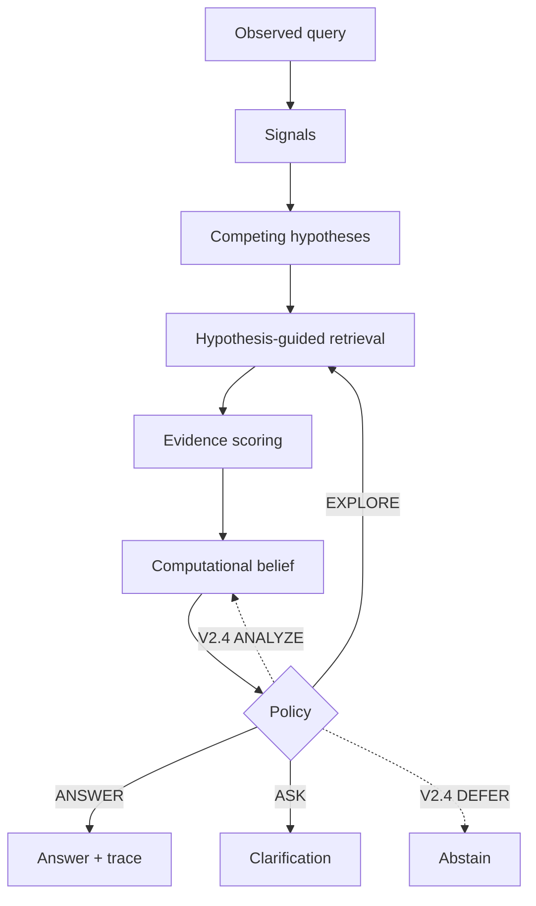

# QUASAR2

**Português:** [README.pt-BR.md](README.pt-BR.md)

Research prototype · package **v0.2.0** · default decision loop frozen at **v0.1.1** · [MIT License](LICENSE) · Crizan Belém Ribeiro

> QUASAR2 is an experimental system for deciding what to do when a query is ambiguous, incomplete, noisy, or only a partial view of what the user actually needs. It keeps several interpretations in play, gathers or re-scores evidence, and then chooses whether to answer, search again, ask a clarifying question — or, on a separate developmental path, analyze, defer, or (optionally) verify.

> [!WARNING]
> This is **mechanism-testing research software**, not a chatbot, not a production agent platform, and not a claim of general superiority over ordinary retrieval. Frozen astronomy/AI numbers diagnose a small synthetic fixture. World Bank WDI numbers diagnose one developmental domain slice. Neither proves that the method works everywhere.

---

## QUASAR2 in 30 seconds

A short query can mean more than one thing. A typical search stack picks one interpretation, retrieves once, and answers. QUASAR2 instead:

1. treats the **observed query** as a noisy measurement of a hidden **latent intent** (the information need that is not fully written down);
2. keeps **competing hypotheses** (explicit candidate interpretations);
3. retrieves and scores **evidence** for those hypotheses;
4. updates a **computational belief** (a normalized score over hypotheses — not automatically a calibrated Bayesian posterior);
5. chooses an **action** using explicit utilities, gates, and costs.

The scientific hypothesis under test, not a slogan:

> **Uncertainty alone does not justify retrieval.**

High uncertainty is not, by itself, a reason to search again. Extra evidence must be **recoverable** (able to separate hypotheses), able to change a **decision**, and worth its **cost and risk**. Sometimes the better move is to ask the user, re-score what you already have, or abstain.

---

## The problem

When a search system or tool-using agent sees an underspecified, degraded, contradictory, or out-of-catalog query, should it:

- **ANSWER** — commit to a response;
- **ANALYZE** — rethink existing evidence without fetching more;
- **EXPLORE** — retrieve additional material;
- **VERIFY** — check a specific claim, source, entity, date, or provenance;
- **ASK** — request clarification;
- **DEFER** — abstain or hand off?

And: **how much is each action worth** in information, utility, latency, and cost?

That question matters at scale. A slightly wrong choice — searching with no gain, answering too early, or asking when a cheap lookup would do — multiplies latency, spend, and error when thousands of queries or agents run.

### An intuitive example

Someone types: *“the starlight keeps dipping when something crosses the disk.”*

That could be an exoplanet transit, disk accretion, or another catalog interpretation. The bundled demo does **not** receive the gold label. It generates candidates, retrieves documents, updates scores, and may **EXPLORE** or **ASK** instead of answering immediately. On the frozen v0.1.1 sanity table, **Full QUASAR2 does not beat a strong Hybrid retriever** on intent recovery. That negative/null result is part of the evidence, not an inconvenience.

### What QUASAR2 is not

- a general chatbot or “AI that understands intent”;
- only another BM25/dense ranker;
- a guarantee that the true intent is in the candidate set;
- a proof that QUASAR2 wins against all baselines;
- a production safety controller or a cloud product;
- a full knowledge **graph** (the optional extra `quasar2[graph]` is empty; there is no graph backend in `src/`);
- conformal prediction (a telemetry field exists; no conformal procedure is implemented);
- FAISS, a public PyPI release workflow, or a REST/UI frontend.

---

## How it works

**Latent intent** — the unobserved need the evaluation fixture may define so the experiment is falsifiable.

**Hypothesis** — an explicit candidate interpretation (catalog id, WDI indicator/entity/period slot, or `H_unknown` on the V2.4 path).

**Belief** — scores over hypotheses. The live system uses \(\hat b_t = \mathcal{B}(z_t)\). An **ideal posterior** \(b^*\) is for oracles and synthetic checks only.

**Retrieval** — fetching candidate documents or structured passages.

**Recoverability** — whether an informative action is likely to produce observations that separate hypotheses. Estimators exist in code; they do **not** currently change the frozen v0.1.1 action.

**Value of Information (VoI)** — expected improvement in decision value from an observation. **NetVoI** subtracts declared cost and risk. Estimated VoI is not oracle VoI.

**Abstention** — ASK (legacy) or DEFER (V2.4) instead of answering.

**Open set** — the true need may be outside the catalog (`H_unknown` on V2.4). High entropy is not the same as open set.

**Calibration** — whether stated confidence matches frequency of being right. Not assumed for the heuristic belief update.



Solid arrows: frozen **legacy** loop (`QuasarPipeline`, default `quasar2 demo`). Dotted arrows: **V2.4** WDI policy (`src/quasar2/v24/`), not selected by the default sanity demo.

The text remains valid if the diagram does not render: observation → hypotheses → retrieval → evidence → belief → action → trace.

### Actions

Confirm in code before treating a row as “the default product.”

| Action | Plain meaning | In this repo | Acquires external evidence? | Terminal? |
|---|---|---|---|---|
| **ANSWER** | Give an answer | Legacy + V2.4 | No (uses evidence already scored) | Yes in both loops |
| **EXPLORE** | Search more, broadly | Legacy + V2.4 | Yes | No |
| **ASK** | Ask the user | Legacy + V2.4 | Interactive (clarification text) | Yes in legacy; V2.4 may continue legally but ASK rate was **0** on the BM25 WDI pilot |
| **ANALYZE** | Re-score what you have | V2.4 heuristic + v2 operator interfaces; **not** in frozen `Action` enum | **No** (invariant: evidence set unchanged) | No |
| **DEFER** | Do not answer now | V2.4 only | No | Yes (empty legal successors) |
| **VERIFY** | Check one targeted claim/source | Enum + transitions exist; **default V2.4 policy does not select it** | Would, if wired to a source | No |

Legacy `Action` is exactly `{ANSWER, EXPLORE, ASK}`. Do not describe VERIFY, ANALYZE, or DEFER as default `quasar2 demo` behavior.

`demo --v2-shadow` records `recommended_action_v2` **without changing** `executed_action_legacy`.

---

## Potential use cases

These are **motivating applications**, not deployments or customer validations.

| Setting | Why a decision layer might matter |
|---|---|
| Enterprise agents | Decide when to call tools vs stop vs ask, before spend explodes |
| Helpdesk / FAQ | Vague tickets without overconfident answers |
| Short-query search | Several SKUs or topics fit the same words |
| Scientific retrieval | Instrument vs target vs date vs claim |
| Data assistants | Country, indicator, unit, year, and data revision |

**When QUASAR2 may not help**

- the query is already unambiguous and cheap to answer;
- extra documents would not separate the remaining hypotheses;
- acquisition cost exceeds expected gain;
- there is no suitable corpus or observation model;
- a single BM25/top-1 lookup already solves the task (observed on the WDI BM25 pilot).

---

## Capability maturity

| Capability | Status | Evidence |
|---|---|---|
| Legacy loop ANSWER / EXPLORE / ASK | VALIDATED_IN_REPOSITORY | `src/quasar2/pipeline.py`, tests, frozen v0.1.1 table |
| BM25, hashing-dense, hybrid | VALIDATED_IN_REPOSITORY | `retrieval/`; hashing **is not neural** |
| Optional neural dense (MiniLM / E5 / BGE-M3) | EXPERIMENTAL | `pip install 'quasar2[neural]'`; CPU smokes; full 3036×strong-neural not run |
| Cross-encoder reranker class | PARTIALLY_IMPLEMENTED | class present; N4 full run **not executed** |
| V2.4 WDI policy (ANALYZE, DEFER, `H_unknown`) | EXPERIMENTAL | BM25 pilot n=3036; top-1 wins intent exact |
| Complexity gate + A1 decomposition | EXPERIMENTAL / INCONCLUSIVE | `gate-experiment`, `a1-decompose`; claim C1 not sealed |
| V2 math, VoI bounds, theory harness | IMPLEMENTED (synthetic checks) | `quasar2 theory-check`; claims not SUPPORTED |
| Recoverability estimators | IMPLEMENTED, not in default policy | `src/quasar2/recoverability.py`; shadow uses proxy kernels |
| VERIFY as selected action | PARTIALLY_IMPLEMENTED | label exists; default policy omits it |
| Knowledge graph | NOT_FOUND | empty extra `graph = []` |
| Conformal prediction | PARTIALLY_IMPLEMENTED | highest-mass heuristic + split-conformal helper; no live calibration split |
| Sequential / anytime UCB stopping in production policy | NOT_FOUND | fixed-stage estimators + T4 harness only |
| JWST / CERN **benchmarks** | NOT_FOUND | metadata fixtures + `jwst-validate` / `cern-validate` only |
| Cloud runner / HTTP API / UI | NOT_FOUND | — |
| `phase-diagram` CLI | IMPLEMENTED (synthetic shadow grid) | `quasar2 phase-diagram`; topology not imposed |

---

## Quick start

Requires **Python 3.10+**. The default runtime has **no mandatory third-party packages**. Optional neural extras download models and need disk, CPU time, and (if you choose) a GPU; GPU is **not** required.

After `pip install -e .`, the console script is `quasar2`. If an older install shadows the tree, use `PYTHONPATH=src python -m quasar2.cli …`.

### Linux / macOS

```bash
python -m venv .venv
source .venv/bin/activate
python -m pip install -e .
quasar2 validate
```

### Windows PowerShell

```powershell
py -m venv .venv
.\.venv\Scripts\Activate.ps1
python -m pip install -e .
quasar2 validate
```

Expected `validate` summary (sanity fixture):

```text
configuration: valid
domains: ai, astronomy
hypotheses: 40
documents: 80
intents: 40
canonical benchmark queries: 120
```

Optional neural stack (not needed for sanity CI):

```bash
python -m pip install -e ".[neural]"
quasar2 neural-doctor
```

`dense` is an alias of `neural`. `all` currently equals neural + pytest. `graph` installs nothing extra.

### One trace

```bash
quasar2 demo \
  --domain astronomy \
  --query "The starlight keeps dipping when something crosses the disk" \
  --trace
```

`--json` writes the structured result. `--ablation` is one of `full`, `noHyp`, `noExplore`, `noUpdate`, `noAsk`. `--v2-shadow` adds diagnostics only.

You should see stages such as `OBSERVATION`, `HYPOTHESES`, `RETRIEVAL`, `EVIDENCE`, `BELIEF`, `DECISION`. Final action on this canonical demo under v0.1.1 pruning is **ASK**, with fewer retrieval calls than v0.1.0 (5 instead of 7 in the documented regression). Exact probabilities vary with config; do not freeze demo scores as a paper result.

### Smoke benchmark

```bash
quasar2 benchmark --limit 3 --methods hybrid,full --conditions q2
```

Default full sanity run:

```bash
quasar2 benchmark --config configs/poc.yaml
```

Writes `experiments/results/benchmark.json` and `.csv` unless `--output` is set.

---

## CLI

| Command | Role | Notes |
|---|---|---|
| `demo` | One inference | `--query`, `--domain`, `--ablation`, `--config`, `--trace`, `--json`, `--v2-shadow` |
| `validate` | Cross-check sanity catalog/corpus/intents | `--config` |
| `benchmark` | Sanity baselines + ablations | `--methods`, `--conditions`, `--limit`, `--output` |
| `experiment` | v0.2 regime factorial | default config `configs/v02_regime.yaml`; `--seeds`, `--limit` |
| `materialize-ops` | Write `data/ops` runbook fixture | no flags |
| `wdi-sync` | Download WDI slice (**network**) | `--output` required; `--stage ci\|pilot`; `--source` default 2 |
| `wdi-validate` | Offline snapshot check | `--snapshot` |
| `wdi-build-corpus` | Count documents in a snapshot | `--snapshot` |
| `dataset-build` | Materialize QUASAR-Bench-WDI JSON | `--dataset` default `wdi-ci`; `--snapshot`; `--output` |
| `wdi-experiment` | Retriever × policy on WDI | `--backends` default `bm25`; `--policies` default `top1,threshold,v24` |
| `gate-experiment` | FAST vs always-on vs gated | `--output` required |
| `a1-decompose` | Rescue / overthinking tables | `--run-dir` (repeatable), `--output` required |
| `neural-doctor` | Print torch / sentence-transformers | exit 1 if ST missing |
| `source-validate` | Typed source family | `--family worldbank_wdi\|jwst_mast\|cern_open_data\|inspire_hep` |
| `jwst-validate` / `cern-validate` | Aliases for metadata fixtures | not full domain benches |
| `repository-audit` | Structural capability manifest | `--output` default `experiments/results/repository_state` |
| `theory-check` | T1–T4 and C1 harness | `--output` default `artifacts/theorem_checks.json`; `--t4-trials` default 400. `--seed` is used by T4; `--offline` skips T2_grid/T4_families; `--dry-run` lists cards; `--fail-fast` exits 1 on FAIL; `--artifact-dir` copies into a run folder. `--max-examples` is still unused. |
| `theorem-benchmark` | Alias of `theory-check` | same flags |
| `report` | Markdown/JSON/CSV theory status | `--output` default `artifacts/theory_report.md`; `--t4-trials` default 200 |
| `phase-diagram` | 2D shadow-action grids | `--output` default `experiments/runs`; `--register` allocates a run id |

There is no `wdi-build-queries` command. Query JSON is produced by `dataset-build`.

---

## Configuration

Default sanity config is `configs/poc.yaml` (JSON-compatible YAML). Groups the parser actually reads include `paths`, `hypotheses`, `retrieval`, `evidence`, `belief`, `exploration`, `decision`, `benchmark`.

```json
"decision": {
  "answer_confidence": 0.67,
  "answer_margin": 0.20,
  "minimum_evidence": 0.28,
  "minimum_exploration_value": 0.04,
  "max_explore_rounds": 2,
  "wrong_answer_cost": 1.4,
  "exploration_cost": 0.10,
  "ask_cost": 0.28,
  "allow_ask": true
}
```

Set `"v2_shadow": true` under `decision` to enable shadow telemetry from config (default false). Developmental knobs live in `configs/v2.yaml`, `configs/v02_regime.yaml`, `configs/gate.yaml`, `configs/a1.yaml`. Do not treat `configs/v2.yaml` as switching the demo onto ANALYZE/DEFER.

---

## Architecture and repository map

| Area | Responsibility |
|---|---|
| `src/quasar2/pipeline.py` | Frozen v0.1.1 loop |
| `src/quasar2/decision/` | Legacy utilities + optional shadow |
| `src/quasar2/belief/` | Heuristic update + ideal vs estimated types |
| `src/quasar2/retrieval/` | BM25, hashing dense, hybrid, optional neural |
| `src/quasar2/v24/` | WDI five-action developmental policy |
| `src/quasar2/wdi/` | Snapshot sync, normalize, evaluate |
| `src/quasar2/math/`, `theory/` | Canonical measures and theorem harness |
| `src/quasar2/gate/` | Complexity gate (Milestone A) |
| `src/quasar2/analysis/` | A1 decomposition + ANALYZE operators |
| `src/quasar2/sources/` | JWST/CERN/INSPIRE **metadata** fixtures |
| `configs/`, `data/`, `docs/`, `experiments/results/`, `tests/` | Frozen parameters, fixtures, protocol, artifacts, tests |

```text
quasar2/
├── configs/
├── data/           # sanity corpus, intents, catalog; ops; WDI snapshots; source fixtures
├── docs/
├── experiments/results/   # including frozen/v0.1.1 and WDI pilots
├── artifacts/      # theorem-check outputs
├── src/quasar2/
└── tests/
```

Library use: `QuasarPipeline.from_config(...)` then `.run(query, domain)`. There is no HTTP server in this repository.

Safeguards in the POC loop: gold intent is not passed in; evidence pairs `(hypothesis_id, document_id)` are unique; exploration queries are hashed; zero-novel rounds stop further EXPLORE; traces keep unfavorable outcomes.

Details: [Architecture](docs/ARCHITECTURE.md), [Trace walkthrough](docs/TRACE_WALKTHROUGH.md).

---

## Retrieval: lexical, hashing, neural, hybrid

| Backend | What it does | Status |
|---|---|---|
| **BM25** | Term overlap | Default scientific comparison on WDI pilot |
| **Hashing dense** (`dense` / `dense_hash`) | Fixed hashing cosine proxy | Debug / negative control — **not** a neural encoder |
| **Hybrid** | BM25 + hashing (sanity) or BM25 + neural | Factory `hybrid`, `hybrid_neural`, `hybrid_bge` |
| **Neural** | sentence-transformers embeddings | Optional; models listed in [Neural retrieval](docs/NEURAL_RETRIEVAL.md) |
| **Reranker** | `CrossEncoderReranker` (BGE reranker id) | Implemented; full N4 cost not run |
| **Graph-assisted retrieval** | — | **Not implemented** |

**Retrieval quality is not decision quality.** A method can win Recall@10 and still ASK too often, answer wrongly, or lose intent exact (see sanity Full vs Hybrid ranking vs IRR).

---

## Data and benchmarks

### Synthetic sanity (astronomy + AI)

| Item | Value | Source |
|---|---|---|
| Hypotheses | 40 (20 astronomy, 20 AI) | `quasar2 validate` / catalog |
| Intents | 40 | `data/intents/` |
| Canonical queries | 120 = 40 × {q0,q1,q2} | validate |
| Documents | 80 | corpus |
| Seed of frozen table | 42 | [frozen manifest](experiments/results/frozen/v0.1.1/MANIFEST.json) |

This fixture is **lexically aligned** and easy. It is CI / mechanism diagnosis, not the primary external claim.

v0.2 adds `quasar2 experiment` on overlapping ops-runbook documents (`configs/v02_regime.yaml`) with matched `full+bm25` / `full+hybrid` cells. Protocol: [v0.2 regime](docs/V0.2_REGIME_PROTOCOL.md).

```powershell
quasar2 materialize-ops
quasar2 experiment --config configs/v02_regime.yaml
```

Smoke: `quasar2 experiment --methods bm25,full+bm25 --seeds 42 --limit 3`

HyDE is **not** bundled (needs a generator). `multi_query` is the stdlib-compatible expansion control in the regime experiment.

### World Bank WDI (real structured domain)

Synthetic control and WDI answer **different** questions. WDI does **not** imply JWST/CERN transfer.

| Snapshot | ID | Scale | Source |
|---|---|---|---|
| CI live | `wdi-ci-2026-08-26-6ead85fe` | 12 indicators; 8 countries + LCN; **1152** observation rows (981 observed / 171 missing) | [WDI dataset card](docs/WDI_DATASET_CARD.md) |
| Pilot live | `wdi-pilot-2026-08-26-b6ddb672` | 30 indicators; 20 countries + aggregate; period **2000–2023**; **15120** rows (12889 / 2231) | same |
| Bench CI JSON | — | `n_canonical=96`, `n_instances=498` | `data/wdi/benchmarks/ci.json` |
| Bench pilot JSON | — | `n_canonical=600`, `n_instances=3036` | `data/wdi/benchmarks/pilot.json` |

Brazil is in the slice. English metadata dominates documents. Annual series only. Convenience sample of economies, not a census.

Offline after sync:

```bash
quasar2 wdi-validate --snapshot data/wdi/snapshots/pilot-live
quasar2 wdi-experiment --snapshot data/wdi/snapshots/pilot-live --stage pilot --backends bm25 --limit 10 --output /tmp/wdi-smoke
```

`wdi-sync` hits the World Bank API (source 2) and writes a new snapshot directory — do not run it “just to read the README.”

### JWST / CERN / INSPIRE

Typed **metadata-only** fixtures and validators. Manifests set `scientific_benchmark_complete: false`. Treat as transfer-domain **scaffolds**, not completed benches.

---

## Metrics (three layers)

Names below appear in sanity `benchmark` output and/or WDI `metrics.json`. Anything else is roadmap.

**Retrieval quality:** Recall@10, MRR, nDCG@10 (sanity). WDI also reports retrieval/decision separately in the V2.4 protocol.

**Interpretation quality:** Intent recovery / intent exact; belief entropy, margin; `H_unknown` mass on V2.4 (open-set tables still incomplete).

**Decision quality:** Autonomous resolution rate (ARR), **correct ARR**, ASK fraction, DEFER rate, wrong-answer rate among ANSWER, retrieval calls, avoided calls, explore rounds, novelty, belief variation, entropy reduction, latency. Paired bootstrap for Full minus Hybrid IRR on the sanity bench.

Better Recall@10 does not imply better final decisions.

---

## Math (compact)

Intuition: **uncertainty** (which hypothesis?), **recoverability** (will an action split them?), **decision value** (will the split change the act?), **cost and risk** (is it worth it?).

\[
\mathcal{H}_t=\{H_1,\ldots,H_K,H_{\mathrm{unknown}}\}
\quad
\hat b_t=\mathcal{B}(z_t)
\]

\[
\operatorname{NetVoI}(a)=\operatorname{VoI}(a)-C_{\mathrm{utility}}(a)-\lambda_R R(a)
\]

A **fixed-stage** UCB stop rule is implemented as estimators and checked synthetically:

\[
\mathrm{STOP}\iff \max_a \mathrm{UCB}(\mathrm{NetVoI}(a))\le 0
\]

That is **not** an anytime sequential guarantee. T4 in-repo used an easy Gaussian mean; sequential coverage is not implemented.

`ANALYZE` (when admissible) tries to reduce **inference error** \(D_{\mathrm{KL}}(\hat b\parallel b^*)\) without new evidence. Heuristic V2.4 ANALYZE does **not** inherit that theorem.

Full statements: [docs/THEORY.md](docs/THEORY.md), [ASSUMPTIONS.md](docs/ASSUMPTIONS.md), [THEOREM_STATUS.md](docs/THEOREM_STATUS.md), [AMBIGUITIES.md](docs/AMBIGUITIES.md).

---

## Current evidence

No claim in [CLAIM_LEDGER.md](CLAIM_LEDGER.md) is `SUPPORTED`. Implementation PASS ≠ scientific support.

### Frozen sanity (v0.1.1, seed 42, 120 queries)

Checked-in copy: `experiments/results/frozen/v0.1.1/`. Quality tuples match v0.1.0; calls dropped because repeated queries are rejected ([redundancy pruning](docs/V0.1.1_REDUNDANCY_PRUNING.md)).

| Method | Intent recovery | Recall@10 | MRR | correct ARR | ASK | Calls | Avoided |
|---|---:|---:|---:|---:|---:|---:|---:|
| BM25 | 0.983 | 0.946 | 0.990 | 0.983 | 0.000 | 1.00 | 0.00 |
| Dense hashing proxy | 0.942 | 0.933 | 0.965 | 0.942 | 0.000 | 1.00 | 0.00 |
| Hybrid | 0.983 | 0.950 | 0.990 | 0.983 | 0.000 | 1.00 | 0.00 |
| Rewrite + Hybrid | 0.958 | 0.979 | 0.976 | 0.958 | 0.000 | 1.00 | 0.00 |
| **Full QUASAR2** | **0.975** | **0.642** | **0.965** | **0.792** | **0.208** | **3.81** | **0.38** |
| noHyp | 0.958 | 0.483 | 0.967 | 0.958 | 0.000 | 1.00 | 0.00 |
| noExplore | 0.983 | 0.521 | 0.960 | 0.742 | 0.258 | 3.26 | 0.00 |
| noUpdate | 0.958 | 0.808 | 0.973 | 0.375 | 0.625 | 4.51 | 1.25 |
| noAsk | 0.975 | 0.642 | 0.965 | 0.975 | 0.000 | 3.81 | 0.38 |

Reading (same as the frozen table, not a new run):

1. Full vs `noHyp` IRR +0.0167, 95% bootstrap **[0.0000, 0.0417]**.
2. Full vs `noExplore` correct ARR +0.0500, interval **[0.0167, 0.0917]**.
3. Full vs Hybrid IRR **−0.0083**, interval about **[−0.0417, 0.0167]** — **includes zero**. Superiority over Hybrid is **not** supported on this fixture.
4. `noAsk` looks accurate because it never abstains; that hides wrong-answer cost.
5. Mean Full calls 4.19 → 3.81 vs v0.1.0 with identical predictions/actions/ranking tuples (1,080 query-level rows across nine methods).

### WDI BM25 pilot (developmental)

From [V2.4 external validation](docs/V2_4_EXTERNAL_VALIDATION_REPORT.md) / `experiments/results/v24_r3_pilot_bm25/` — **not sealed**, no clustered CI:

| Method | Intent exact | WAR among ANSWER | Coverage | ASK | DEFER | Calls |
|---|---:|---:|---:|---:|---:|---:|
| BM25 top-1 | 0.643 | 0.357 | 1.000 | 0 | 0 | 1.00 |
| BM25 threshold | 0.146 | 0.594 | 0.360 | 0 | 0.640 | 1.00 |
| BM25 V2.4 | 0.525 | 0.323 | 0.776 | 0 | 0.224 | 2.91 |

**Top-1 BM25 beats V2.4 on intent exact** at lower call cost. ASK never fired. MiniLM CI smoke n=40: BM25 top-1 0.775 vs MiniLM top-1 0.750. Gated compute (Milestone A / A1) is **INCONCLUSIVE**.

### Theory harness

`artifacts/theorem_checks.json`: C1, T1, T2, T3, T4 recorded `PASS_WITHIN_ASSUMPTIONS` under their synthetic assumptions. T4 used a well-separated Gaussian mean (easy). Heuristic ANALYZE is outside T1.

---

## Tests and reproduction

```bash
python -m pip install -e ".[dev]"
python -m pytest -q
```

Stdlib alternative: `PYTHONPATH=src python -m unittest discover -s tests -v`.

Seeds, configs, and frozen JSON/CSV live under `experiments/results/` and `artifacts/`. Compare methods on the **same** queries and seeds (`benchmark` paired bootstrap; WDI crossed backends). Record git SHA and snapshot ids when publishing a run. `theory-check` / `report` rewrite files under `artifacts/` if you point `--output` there.

---

## Limitations

- Bounds on VoI can be vacuous; Lipschitz constants on real utilities are often unknown.
- Recoverability and observation kernels on WDI are estimated or unused by the live policy.
- \(b^*\) is generally unavailable on real queries.
- Heuristic ANALYZE ≠ variational T1.
- Conformal coverage is not implemented; if added later it would be **marginal** under exchangeability, not per-query certainty.
- UCB false-stop control is fixed-stage and estimator-dependent.
- Retrieved text is **untrusted data**, not instructions.
- Neural models can mis-rank under language/domain shift (observed PT electricity query smoke).
- WDI is one structured domain with missingness and English-heavy metadata.
- Graph edges cannot leak gold labels — moot until a graph exists.
- External APIs (`wdi-sync`, model downloads) add cost, latency, and failure modes.
- CHANGELOG 0.2.0 still says \(H_{\mathrm{unknown}}\) / DEFER were deferred to v0.3; **operationally** they exist on the V2.4 path while remaining absent from the frozen three-action loop. Trust the code paths above.

Claim policy and paper-scale gaps: [Limitations](docs/LIMITATIONS.md), [Scientific thesis](docs/SCIENTIFIC_THESIS.md), [Experiment protocol](docs/EXPERIMENT_PROTOCOL.md).

---

## Roadmap (not implemented as product)

- Graph backend, provenance traversal, graph ablations.
- VERIFY selected by policy with independent sources.
- Sequential / anytime stopping; tight T4 near zero / heavy tails.
- Recoverability-driven EXPLORE in the **executed** policy (today: shadow / estimators only).
- Completed JWST/CERN query benches (fixtures only now).
- Fair BM25 vs dense vs hybrid vs rerank under equal budgets on the full pilot.
- Pre-registered clustered intervals before any `SUPPORTED` claim.
- Cloud/stateless runners, public PyPI automation, UI.

Former v0.3 policy note: [docs/V0.2_EXPERIMENT_PROTOCOL.md](docs/V0.2_EXPERIMENT_PROTOCOL.md) described DEFER/`H_unknown` as future relative to the frozen loop; V2.4 is the developmental implementation of part of that agenda.

---

## Further documentation

| Doc | Content |
|---|---|
| [docs/THEORY.md](docs/THEORY.md) | Canonical T1–T4, C1 |
| [CLAIM_LEDGER.md](CLAIM_LEDGER.md) / [docs/CLAIM_LEDGER.md](docs/CLAIM_LEDGER.md) | Claim statuses |
| [docs/V2_REPOSITORY_AUDIT.md](docs/V2_REPOSITORY_AUDIT.md) | M0 audit |
| [docs/V2_4_PROTOCOL.md](docs/V2_4_PROTOCOL.md) | WDI protocol |
| [docs/WORLD_BANK_WDI.md](docs/WORLD_BANK_WDI.md) | WDI notes |
| [docs/MILESTONE_A.md](docs/MILESTONE_A.md) / [A1](docs/MILESTONE_A1.md) | Gate and decomposition |
| [docs/SOURCE_REGISTRY.md](docs/SOURCE_REGISTRY.md) | Source families |
| [docs/EXTENDING.md](docs/EXTENDING.md) | Add a domain or retriever |
| [docs/DATA_AND_METRICS.md](docs/DATA_AND_METRICS.md) | Sanity metrics |

---

## Contributing, citation, license

Follow [docs/EXTENDING.md](docs/EXTENDING.md): do not tune catalogs on held-out failures; keep gold labels out of the policy.

There is no DOI. Cite the repository and the frozen run ids you actually used.

MIT License — [LICENSE](LICENSE). World Bank WDI attribution is in each snapshot `LICENSE_AND_ATTRIBUTION.md`. JWST/CERN fixture attribution is in their manifests.
