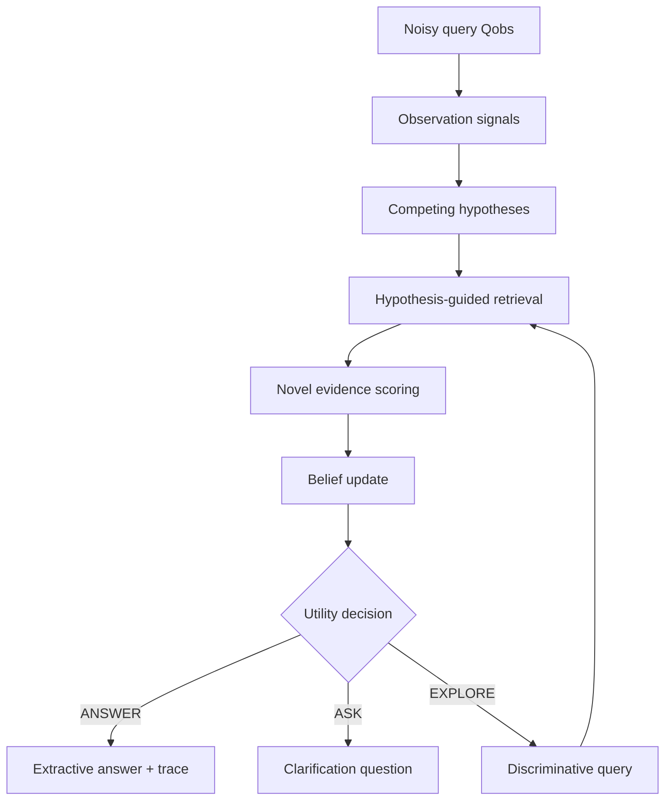

# QUASAR2

**Competing-hypothesis retrieval for latent-intent recovery under query degradation**  
Research proof of concept · v0.1.1 · Crizan Belém Ribeiro

> Treat the observed query as a noisy measurement of a latent information need;
> preserve several plausible interpretations; acquire evidence that separates
> them; then choose **ANSWER**, **EXPLORE**, or **ASK** by explicit utility.

> [!WARNING]
> QUASAR2 is mechanism-testing research software. It is not a production search
> engine and the bundled benchmark does not establish general superiority,
> novelty, causality, or production readiness.

Portuguese overview: [README.pt-BR.md](README.pt-BR.md).

## The falsifiable question

Let an observed query \(Q_{obs}\) be a degraded view of a latent intent \(I\).
A conventional pipeline commits to one query representation and retrieves once.
QUASAR2 instead maintains candidate hypotheses \(H_1,\ldots,H_k\), retrieves
hypothesis-conditioned evidence, updates a belief distribution, and may issue a
discriminative follow-up retrieval.

The POC asks a narrow question:

> Under controlled query degradation, does maintaining competing hypotheses and
> using `EXPLORE` increase correct autonomous resolution relative to compatible
> single-commitment and no-exploration controls—and in which regimes does it
> tie, lose, or abstain?

The hypothesis is allowed to fail. The benchmark retains unfavorable outcomes
and reports a paired confidence interval rather than presenting one successful
demo as evidence.

## What is implemented

- deterministic multi-signal observation extraction;
- **Mode A**, a frozen catalog with 20 astronomy and 20 AI hypotheses;
- **Mode B**, a typed dependency-injection boundary for an LLM or knowledge base;
- transparent BM25, deterministic hashing-vector, and hybrid retrieval;
- evidence scoring with observation, anchor, discriminator, and provenance terms;
- posterior-like belief updates with duplicate-evidence suppression;
- SHA-256 query history and pre-retrieval rejection of repeated exploration;
- zero-novel-evidence termination without changing the frozen v0.1 decision policy;
- expected-utility `ANSWER / EXPLORE / ASK` decisions;
- autonomous contrastive retrieval between the two leading hypotheses;
- four retrieval baselines and five mechanism ablations;
- 40 intents × three query conditions = **120 canonical observations**;
- 80 corpus documents split into core and discriminative evidence;
- Recall@10, MRR, nDCG@10, Intent Recovery Rate, ARR, correct ARR,
  ASK fraction, calls, avoided calls, exploration rounds, document novelty,
  belief variation, entropy reduction, latency, and robustness ratio;
- paired bootstrap interval for Full minus Hybrid intent recovery;
- JSON traces, JSON/CSV experiment outputs, validation, and unit tests.

The “dense” component is explicitly a local feature-hashing cosine proxy, **not
a claim that a neural DPR model is bundled**. Its interface can be replaced by a
sentence-transformer or hosted embedding model in a later controlled study.

## Quick start

Python 3.10 or newer is required. Runtime execution has no mandatory third-party
dependency.

### Linux/macOS

```bash
python -m venv .venv
source .venv/bin/activate
python -m pip install -e .
quasar2 validate
```

### Windows PowerShell

```powershell
py -m venv .venv
.\.venv\Scripts\Activate.ps1
python -m pip install -e .
quasar2 validate
```

Expected validation summary:

```text
configuration: valid
domains: ai, astronomy
hypotheses: 40
documents: 80
intents: 40 ({'astronomy': 20, 'ai': 20})
canonical benchmark queries: 120
```

## Run one complete trace

```bash
quasar2 demo \
  --domain astronomy \
  --query "The starlight keeps dipping when something crosses the disk" \
  --trace
```

The trace exposes every transition:

```text
OBSERVATION -> HYPOTHESES -> RETRIEVAL -> EVIDENCE -> BELIEF
            -> DECISION -> [EXPLORE -> ...] -> ANSWER | ASK
                              | repeated/zero novelty
                              +-> PRUNE -> ANSWER | ASK
```

Use `--json` for a machine-readable record. Use `--ablation noHyp`,
`noExplore`, `noUpdate`, or `noAsk` to inspect a mechanism control.

## Run the benchmark

```bash
quasar2 benchmark --config configs/poc.yaml
```

The command writes:

- `experiments/results/benchmark.json`: configuration, aggregate metrics,
  condition metrics, paired comparison, and every individual run;
- `experiments/results/benchmark.csv`: flat per-query results for analysis.

A fast smoke run is available during development:

```bash
quasar2 benchmark --limit 3 --methods hybrid,full --conditions q2
```

## Bundled POC result

The repository includes the deterministic seed-42 run. Values below are not a
paper result; they characterize this synthetic diagnostic fixture.

The checked-in table is regenerated for v0.1.1. Quality columns remain directly
comparable with v0.1.0; `Calls` may decrease because a query is now rejected
before an identical retrieval is executed. See
[v0.1.1 redundancy pruning](docs/V0.1.1_REDUNDANCY_PRUNING.md) for the exact
invariant and regression case.

| Method | Intent recovery | Recall@10 | MRR | correct ARR | ASK | Calls | Avoided |
|---|---:|---:|---:|---:|---:|---:|---:|
| BM25 | 0.983 | 0.946 | 0.990 | 0.983 | 0.000 | 1.00 | 0.00 |
| Dense hashing proxy | 0.942 | 0.933 | 0.965 | 0.942 | 0.000 | 1.00 | 0.00 |
| Hybrid | 0.983 | 0.950 | 0.990 | 0.983 | 0.000 | 1.00 | 0.00 |
| Rewrite + Hybrid | 0.958 | 0.979 | 0.976 | 0.958 | 0.000 | 1.00 | 0.00 |
| **Full QUASAR2** | **0.975** | **0.642** | **0.965** | **0.792** | **0.208** | **3.81** | **0.38** |
| noHyp | 0.958 | 0.483 | 0.967 | 0.958 | 0.000 | 1.00 | 0.00 |
| noExplore | 0.983 | 0.521 | 0.960 | 0.742 | 0.258 | 3.26 | 0.00 |
| noUpdate | 0.958 | 0.808 | 0.973 | 0.375 | 0.625 | 4.51 | 1.25 |
| noAsk | 0.975 | 0.642 | 0.965 | 0.975 | 0.000 | 3.81 | 0.38 |

What this result says:

1. Full improves intent recovery over single commitment (`noHyp`) from 0.958
   to 0.975. The paired difference is +0.0167 with a 95% bootstrap interval
   of [0.0000, 0.0417].
2. EXPLORE increases correct autonomous resolution relative to `noExplore`
   from 0.742 to 0.792, while lowering ASK from 0.258 to 0.208. The paired
   correct-ARR difference is +0.0500 with interval [0.0167, 0.0917].
3. Full does **not** beat the strong Hybrid baseline on this easy synthetic
   corpus: 0.975 versus 0.983 intent recovery. The paired Full-minus-Hybrid
   difference is -0.0083 with a 95% bootstrap interval of approximately
   [-0.0417, 0.0167], which includes zero.
4. `noAsk` looks strong on correctness but forces an answer for every case. A
   deployment decision would need a calibrated cost for wrong answers rather
   than treating coverage as free.
5. Relative to v0.1.0, v0.1.1 changes none of the 1,080 query-level prediction,
   action, or ranking-quality tuples across the nine methods. It reduces mean
   calls for Full from 4.19 to 3.81, for `noUpdate` from 5.76 to 4.51, and for
   `noAsk` from 4.19 to 3.81.

Therefore the current run shows an internal mechanism signal but **does not
validate the stronger superiority claim**. That is a useful POC outcome: the
implementation can falsify the thesis instead of only illustrating it.

## Architecture



Important safeguards in the POC:

- the ground-truth intent is never passed to the pipeline;
- evidence is deduplicated by `(hypothesis_id, document_id)`;
- retrieval queries are deduplicated by a stable hypothesis-conditioned hash;
- a zero-novel acquisition round disables further automatic exploration;
- exploration is limited and charged a utility cost;
- a hypothesis must pass confidence, margin, and evidence gates to answer;
- all actions, probabilities, evidence, and retrieval queries are traced;
- unfavorable query-level results are retained in benchmark output.

See [Architecture](docs/ARCHITECTURE.md) for components, interfaces, and data
flow, and [Trace walkthrough](docs/TRACE_WALKTHROUGH.md) for a concrete run.

## Repository map

```text
quasar2/
├── configs/                 # frozen POC parameters and domain registry
├── data/
│   ├── corpus/              # 80 JSONL evidence documents
│   ├── hypotheses_catalog/  # Mode-A hypothesis definitions
│   └── intents/             # 40 intents with Q0/Q1/Q2
├── docs/                    # thesis, architecture, protocol, limitations
├── experiments/
│   ├── degradation/         # controlled degradation import
│   ├── baselines/           # baseline specification
│   ├── ablations/           # ablation specification
│   └── results/             # deterministic JSON/CSV outputs
├── src/quasar2/             # installable implementation
└── tests/                   # component, pipeline, and benchmark tests
```

## Reproduce tests

```bash
PYTHONPATH=src python -m unittest discover -s tests -v
```

The suite uses only the standard library. After `pip install -e .`, the
`PYTHONPATH=src` prefix is unnecessary. Pytest can also discover these tests if
installed through `python -m pip install -e ".[dev]"`.

## Scientific protocol and claim boundary

The bundled data is synthetic and intentionally small. It diagnoses whether the
mechanism executes and exposes failure modes; it is not evidence that the method
will generalize to real search traffic.

Before a paper-level claim, the project requires:

- frozen train/calibration/validation/test roles with leakage controls;
- at least 30 retained perturbation seeds;
- stronger neural retrieval, rewrite, HyDE, and reranking controls where
  compatible;
- threshold calibration on calibration data only;
- paired uncertainty for every primary comparison;
- real-domain evaluation, including precisely versioned datasets;
- cost/quality curves and failure-regime analysis under missingness, conflict,
  drift, and adversarial noise;
- a systematic related-work and prior-art review before a novelty statement.

Full details: [Scientific thesis](docs/SCIENTIFIC_THESIS.md),
[Experiment protocol](docs/EXPERIMENT_PROTOCOL.md),
[Data and metrics](docs/DATA_AND_METRICS.md), and
[Limitations](docs/LIMITATIONS.md). The frozen next-version design is in the
[v0.2 experimental protocol](docs/V0.2_EXPERIMENT_PROTOCOL.md).

## License

MIT License. See [LICENSE](LICENSE).
