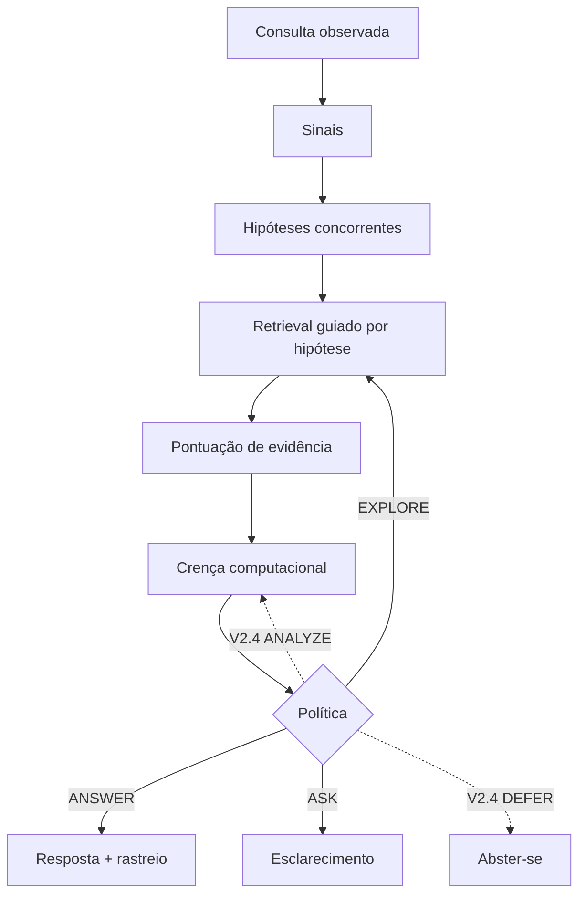

# QUASAR2

**English:** [README.md](README.md)

Protótipo de pesquisa · pacote **v0.2.0** · laço de decisão padrão congelado na **v0.1.1** · [Licença MIT](LICENSE) · Crizan Belém Ribeiro

> O QUASAR2 é um sistema experimental para decidir o que fazer quando uma consulta é ambígua, incompleta, ruidosa ou só um recorte do que a pessoa realmente precisa. Ele mantém várias interpretações em jogo, reúne ou reavalia evidências e escolhe se deve responder, buscar de novo, pedir esclarecimento — ou, num caminho de desenvolvimento separado, analisar, se abster ou (opcionalmente) verificar.

> [!WARNING]
> Isto é **software de pesquisa para testar mecanismos**, não um chatbot, não uma plataforma de agentes em produção e não uma prova de superioridade geral sobre recuperação comum. Os números congelados de astronomia/IA diagnosticam um fixture sintético pequeno. Os números do WDI do Banco Mundial diagnosticam um recorte de domínio em desenvolvimento. Nenhum dos dois prova que o método funciona em todo lugar.

---

## QUASAR2 em 30 segundos

Uma consulta curta pode significar mais de uma coisa. Uma pilha típica de busca escolhe uma interpretação, recupera uma vez e responde. O QUASAR2, em vez disso:

1. trata a **consulta observada** como uma medição ruidosa de uma **intenção latente** (a necessidade de informação que não está totalmente escrita);
2. mantém **hipóteses concorrentes** (interpretações candidatas explícitas);
3. recupera e pontua **evidência** para essas hipóteses;
4. atualiza uma **crença computacional** (escores normalizados sobre hipóteses — não automaticamente um posterior bayesiano calibrado);
5. escolhe uma **ação** com utilidades, gates e custos explícitos.

A hipótese científica em teste, não um slogan:

> **Incerteza sozinha não justifica retrieval.**

Incerteza alta, por si só, não é motivo para buscar de novo. A evidência extra precisa ser **recuperável** (capaz de separar hipóteses), capaz de mudar uma **decisão**, e valer o **custo e o risco**. Às vezes o melhor passo é perguntar ao usuário, reavaliar o que já existe ou se abster.

---

## O problema

Quando um sistema de busca ou um agente que chama ferramentas recebe uma consulta subespecificada, degradada, contraditória ou fora do catálogo, ele deve:

- **ANSWER** — comprometer-se com uma resposta;
- **ANALYZE** — raciocinar sobre evidência já obtida, sem buscar mais;
- **EXPLORE** — recuperar material adicional;
- **VERIFY** — checar uma afirmação, fonte, entidade, data ou proveniência específica;
- **ASK** — pedir esclarecimento;
- **DEFER** — abster-se ou encaminhar?

E: **quanto vale cada ação** em informação, utilidade, latência e custo?

Isso importa em escala. Uma escolha um pouco errada — buscar sem ganho, responder cedo demais ou perguntar quando uma consulta barata resolveria — multiplica latência, gasto e erro quando milhares de consultas ou agentes rodam.

### Um exemplo intuitivo

Alguém escreve: *“the starlight keeps dipping when something crosses the disk.”*

Pode ser trânsito de exoplaneta, acreção em disco ou outra interpretação do catálogo. A demo empacotada **não** recebe o rótulo ouro. Ela gera candidatos, recupera documentos, atualiza escores e pode **EXPLORE** ou **ASK** em vez de responder na hora. Na tabela congelada v0.1.1, o **Full QUASAR2 não supera um Hybrid forte** em recuperação de intenção. Esse resultado negativo/nulo faz parte da evidência, não é um incômodo.

### O que o QUASAR2 não é

- um chatbot geral ou “IA que entende intenção”;
- apenas mais um ranker BM25/denso;
- garantia de que a intenção verdadeira está no conjunto de candidatos;
- prova de que o QUASAR2 vence todos os baselines;
- controlador de segurança de produção ou produto em nuvem;
- um **grafo** de conhecimento completo (o extra opcional `quasar2[graph]` está vazio; não há backend de grafo em `src/`);
- conformal prediction (existe um campo de telemetria; não há procedimento conformal);
- FAISS, publicação automatizada no PyPI ou frontend REST/UI.

---

## Como funciona

**Intenção latente** — a necessidade não observada que o fixture de avaliação pode definir para o experimento ser falsificável.

**Hipótese** — uma interpretação candidata explícita (id de catálogo, slots WDI de indicador/entidade/período, ou `H_unknown` no caminho V2.4).

**Crença** — escores sobre hipóteses. O sistema ao vivo usa \(\hat b_t = \mathcal{B}(z_t)\). O **posterior ideal** \(b^*\) serve a oráculos e checagens sintéticas.

**Retrieval** — busca de documentos ou passagens estruturadas.

**Recoverability (recuperabilidade)** — se uma ação informativa tende a produzir observações que separam hipóteses. Há estimadores no código; eles **não** mudam a ação congelada da v0.1.1.

**Value of Information (VoI)** — ganho esperado de valor de decisão a partir de uma observação. **NetVoI** subtrai custo e risco declarados. VoI estimado não é VoI de oráculo.

**Abstenção** — ASK (legado) ou DEFER (V2.4) em vez de responder.

**Open set** — a necessidade verdadeira pode estar fora do catálogo (`H_unknown` no V2.4). Entropia alta não é a mesma coisa que open set.

**Calibração** — se a confiança declarada corresponde à frequência de acerto. Não é assumida na atualização heurística de crença.



Setas contínuas: laço **legado** congelado (`QuasarPipeline`, `quasar2 demo` padrão). Setas pontilhadas: política **V2.4** de WDI (`src/quasar2/v24/`), não selecionada pela demo de sanidade.

O texto vale mesmo se o diagrama não renderizar: observação → hipóteses → retrieval → evidência → crença → ação → rastreio.

### Ações

Confirme no código antes de tratar uma linha como “o produto padrão”.

| Ação | Significado simples | Neste repositório | Adquire evidência externa? | Terminal? |
|---|---|---|---|---|
| **ANSWER** | Responder | Legado + V2.4 | Não (usa evidência já pontuada) | Sim nos dois laços |
| **EXPLORE** | Buscar mais, de forma ampla | Legado + V2.4 | Sim | Não |
| **ASK** | Perguntar ao usuário | Legado + V2.4 | Interativa (texto de esclarecimento) | Sim no legado; no V2.4 a taxa de ASK foi **0** no piloto BM25 WDI |
| **ANALYZE** | Reavaliar o que já existe | Heurística V2.4 + interfaces de operadores v2; **não** no enum congelado `Action` | **Não** (invariante: o conjunto de evidência não muda) | Não |
| **DEFER** | Não responder agora | Somente V2.4 | Não | Sim (sem sucessores legais) |
| **VERIFY** | Checar um alvo específico | Enum e transições existem; a **política V2.4 padrão não o seleciona** | Selecionaria fonte, se ligada | Não |

O `Action` legado é exatamente `{ANSWER, EXPLORE, ASK}`. Não descreva VERIFY, ANALYZE ou DEFER como comportamento padrão de `quasar2 demo`.

`demo --v2-shadow` registra `recommended_action_v2` **sem alterar** `executed_action_legacy`.

---

## Casos de uso potenciais

São **motivações**, não deploys nem validações com clientes.

| Contexto | Por que uma camada de decisão pode importar |
|---|---|
| Agentes empresariais | Decidir quando chamar ferramentas, parar ou perguntar, antes do custo explodir |
| Helpdesk / FAQ | Pedidos vagos sem respostas superconfidentes |
| Busca de consulta curta | Vários produtos ou tópicos cabem nas mesmas palavras |
| Retrieval científico | Instrumento vs alvo vs data vs afirmação |
| Assistentes de dados | País, indicador, unidade, ano e revisão do dado |

**Quando o QUASAR2 pode não ajudar**

- a consulta já é clara e barata de responder;
- documentos extras não separariam as hipóteses restantes;
- o custo de aquisição supera o ganho esperado;
- não há corpus ou modelo de observação adequado;
- um BM25/top-1 já resolve a tarefa (observado no piloto BM25 WDI).

---

## Maturidade das capacidades

| Capacidade | Status | Evidência |
|---|---|---|
| Laço legado ANSWER / EXPLORE / ASK | VALIDATED_IN_REPOSITORY | `src/quasar2/pipeline.py`, testes, tabela congelada v0.1.1 |
| BM25, denso por hashing, híbrido | VALIDATED_IN_REPOSITORY | `retrieval/`; hashing **não é neural** |
| Denso neural opcional (MiniLM / E5 / BGE-M3) | EXPERIMENTAL | `pip install 'quasar2[neural]'`; smokes em CPU; 3036×neural forte não rodado por completo |
| Classe de reranker cross-encoder | PARTIALLY_IMPLEMENTED | classe presente; corrida N4 completa **não executada** |
| Política V2.4 WDI (ANALYZE, DEFER, `H_unknown`) | EXPERIMENTAL | piloto BM25 n=3036; top-1 vence em intent exact |
| Gate de complexidade + decomposição A1 | EXPERIMENTAL / INCONCLUSIVE | `gate-experiment`, `a1-decompose`; claim C1 não selado |
| Matemática V2, bounds de VoI, harness | IMPLEMENTED (checagens sintéticas) | `quasar2 theory-check`; claims não SUPPORTED |
| Estimadores de recoverability | IMPLEMENTED, fora da política padrão | `src/quasar2/recoverability.py`; shadow usa kernels proxy |
| VERIFY como ação escolhida | PARTIALLY_IMPLEMENTED | rótulo existe; política padrão omite |
| Grafo de conhecimento | NOT_FOUND | extra vazio `graph = []` |
| Conformal prediction | PARTIALLY_IMPLEMENTED | heurística highest-mass + helper split-conformal; sem split de calibração no laço vivo |
| Stopping UCB sequencial/anytime na política real | NOT_FOUND | estimadores de estágio fixo + harness T4 |
| Benchmarks **JWST / CERN** | NOT_FOUND | fixtures de metadados + `jwst-validate` / `cern-validate` |
| Runner em nuvem / API HTTP / UI | NOT_FOUND | — |
| CLI `phase-diagram` | IMPLEMENTED (grid sintético shadow) | `quasar2 phase-diagram`; topologia não imposta |

---

## Início rápido

Requer **Python 3.10+**. O runtime padrão **não tem dependência de terceiros obrigatória**. Extras neurais baixam modelos e usam disco e CPU (GPU opcional, **não** obrigatória).

Depois de `pip install -e .`, o comando é `quasar2`. Se um install antigo sombrear a árvore, use `PYTHONPATH=src python -m quasar2.cli …`.

### Linux / macOS

```bash
python -m venv .venv
source .venv/bin/activate
python -m pip install -e .
quasar2 validate
```

### Windows PowerShell

```powershell
py -m venv .venv
.\.venv\Scripts\Activate.ps1
python -m pip install -e .
quasar2 validate
```

Resumo esperado do `validate` (fixture de sanidade):

```text
configuration: valid
domains: ai, astronomy
hypotheses: 40
documents: 80
intents: 40
canonical benchmark queries: 120
```

Pilha neural opcional (desnecessária para CI de sanidade):

```bash
python -m pip install -e ".[neural]"
quasar2 neural-doctor
```

`dense` é alias de `neural`. `all` hoje equivale a neural + pytest. `graph` não instala nada a mais.

### Um rastreio

```bash
quasar2 demo \
  --domain astronomy \
  --query "The starlight keeps dipping when something crosses the disk" \
  --trace
```

`--json` grava o resultado estruturado. `--ablation` é um de `full`, `noHyp`, `noExplore`, `noUpdate`, `noAsk`. `--v2-shadow` só acrescenta diagnóstico.

Você deve ver estágios como `OBSERVATION`, `HYPOTHESES`, `RETRIEVAL`, `EVIDENCE`, `BELIEF`, `DECISION`. A ação final desta demo canônica sob a poda v0.1.1 é **ASK**, com menos chamadas de retrieval que a v0.1.0 (5 em vez de 7 no caso de regressão documentado). Probabilidades exatas variam com a config; não congele escores da demo como resultado de artigo.

### Smoke do benchmark

```bash
quasar2 benchmark --limit 3 --methods hybrid,full --conditions q2
```

Corrida completa de sanidade:

```bash
quasar2 benchmark --config configs/poc.yaml
```

Grava `experiments/results/benchmark.json` e `.csv`, salvo `--output`.

---

## CLI

| Comando | Papel | Notas |
|---|---|---|
| `demo` | Uma inferência | `--query`, `--domain`, `--ablation`, `--config`, `--trace`, `--json`, `--v2-shadow` |
| `validate` | Cruza catálogo/corpus/intenções de sanidade | `--config` |
| `benchmark` | Baselines e ablações de sanidade | `--methods`, `--conditions`, `--limit`, `--output` |
| `experiment` | Fatorial de regime v0.2 | config padrão `configs/v02_regime.yaml`; `--seeds`, `--limit` |
| `materialize-ops` | Escreve o fixture `data/ops` | sem flags |
| `wdi-sync` | Baixa recorte WDI (**rede**) | `--output` obrigatório; `--stage ci\|pilot`; `--source` padrão 2 |
| `wdi-validate` | Checagem offline do snapshot | `--snapshot` |
| `wdi-build-corpus` | Conta documentos do snapshot | `--snapshot` |
| `dataset-build` | Materializa JSON QUASAR-Bench-WDI | `--dataset` padrão `wdi-ci`; `--snapshot`; `--output` |
| `wdi-experiment` | Retriever × política no WDI | `--backends` padrão `bm25`; `--policies` padrão `top1,threshold,v24` |
| `gate-experiment` | FAST vs sempre ligado vs gated | `--output` obrigatório |
| `a1-decompose` | Tabelas de rescue / overthinking | `--run-dir` (repetível), `--output` obrigatório |
| `neural-doctor` | Versões de torch / sentence-transformers | exit 1 se ST faltar |
| `source-validate` | Família de fonte tipada | `--family worldbank_wdi\|jwst_mast\|cern_open_data\|inspire_hep` |
| `jwst-validate` / `cern-validate` | Aliases dos fixtures de metadados | não são benches de domínio completos |
| `repository-audit` | Manifesto estrutural de capacidades | `--output` padrão `experiments/results/repository_state` |
| `theory-check` | Harness T1–T4 e C1 | `--output` padrão `artifacts/theorem_checks.json`; `--t4-trials` padrão 400. `--seed` entra no T4; `--offline` omite T2_grid/T4_families; `--dry-run` lista cards; `--fail-fast` sai 1 em FAIL; `--artifact-dir` copia para uma pasta de run. `--max-examples` ainda não é usado. |
| `theorem-benchmark` | Alias de `theory-check` | mesmas flags |
| `report` | Relatório markdown/JSON/CSV de teoria | `--output` padrão `artifacts/theory_report.md`; `--t4-trials` padrão 200 |
| `phase-diagram` | Grades 2D da ação shadow | `--output` padrão `experiments/runs`; `--register` aloca um run id |
| `cycle2-audit` | Caminho Cycle 2 (recuperabilidade / política) | não altera o laço legado |
| `external-validity` | Auditoria de fontes NASA/ESA/observatório, transferência, escala, orçamento igual, regime | `--smoke` no CI; **não** é dump TAP ao vivo |
| `reproduce-paper` | Reconstrói tabelas congeladas e o programa offline | sem download mutável silencioso |

Não existe o comando `wdi-build-queries`. O JSON de queries sai de `dataset-build`.

---

## Configuração

A config padrão de sanidade é `configs/poc.yaml` (YAML compatível com JSON). Grupos que o parser lê incluem `paths`, `hypotheses`, `retrieval`, `evidence`, `belief`, `exploration`, `decision`, `benchmark`.

```json
"decision": {
  "answer_confidence": 0.67,
  "answer_margin": 0.20,
  "minimum_evidence": 0.28,
  "minimum_exploration_value": 0.04,
  "max_explore_rounds": 2,
  "wrong_answer_cost": 1.4,
  "exploration_cost": 0.10,
  "ask_cost": 0.28,
  "allow_ask": true
}
```

`"v2_shadow": true` em `decision` liga telemetria sombra pela config (padrão false). Ajustes de desenvolvimento estão em `configs/v2.yaml`, `configs/v02_regime.yaml`, `configs/gate.yaml`, `configs/a1.yaml`. Não trate `configs/v2.yaml` como troca da demo para ANALYZE/DEFER.

---

## Arquitetura e mapa do repositório

| Área | Responsabilidade |
|---|---|
| `src/quasar2/pipeline.py` | Laço congelado v0.1.1 |
| `src/quasar2/decision/` | Utilidades legadas + sombra opcional |
| `src/quasar2/belief/` | Atualização heurística + tipos ideal vs estimado |
| `src/quasar2/retrieval/` | BM25, denso por hashing, híbrido, neural opcional |
| `src/quasar2/v24/` | Política WDI de desenvolvimento (cinco ações) |
| `src/quasar2/wdi/` | Sync, normalização, avaliação de snapshot |
| `src/quasar2/math/`, `theory/` | Medidas canônicas e harness de teoremas |
| `src/quasar2/gate/` | Gate de complexidade (Milestone A) |
| `src/quasar2/analysis/` | Decomposição A1 + operadores ANALYZE |
| `src/quasar2/sources/` | Fixtures de **metadados** JWST/CERN/INSPIRE |
| `configs/`, `data/`, `docs/`, `experiments/results/`, `tests/` | Parâmetros, fixtures, protocolo, artefatos, testes |

```text
quasar2/
├── configs/
├── data/           # corpus de sanidade, intents, catálogo; ops; snapshots WDI; fixtures de fonte
├── docs/
├── experiments/results/   # inclusive frozen/v0.1.1 e pilotos WDI
├── artifacts/      # saídas do theory-check
├── src/quasar2/
└── tests/
```

Uso como biblioteca: `QuasarPipeline.from_config(...)` e `.run(query, domain)`. Não há servidor HTTP neste repositório.

Salvaguardas do laço POC: a intenção ouro não entra no pipeline; pares `(hypothesis_id, document_id)` são únicos; queries de exploração são hasheadas; rodada sem novidade interrompe EXPLORE; o rastreio guarda desfechos desfavoráveis.

Detalhes: [Architecture](docs/ARCHITECTURE.md), [Trace walkthrough](docs/TRACE_WALKTHROUGH.md).

---

## Retrieval: lexical, hashing, neural, híbrido

| Backend | O que faz | Status |
|---|---|---|
| **BM25** | Sobreposição de termos | Comparação científica padrão no piloto WDI |
| **Denso por hashing** (`dense` / `dense_hash`) | Proxy cosseno de hashing fixo | Debug / controle negativo — **não** é encoder neural |
| **Híbrido** | BM25 + hashing (sanidade) ou BM25 + neural | Factory `hybrid`, `hybrid_neural`, `hybrid_bge` |
| **Neural** | embeddings sentence-transformers | Opcional; modelos em [Neural retrieval](docs/NEURAL_RETRIEVAL.md) |
| **Reranker** | `CrossEncoderReranker` (id BGE reranker) | Implementado; custo N4 completo não rodado |
| **Retrieval assistido por grafo** | — | **Não implementado** |

**Qualidade de retrieval não é qualidade de decisão.** Um método pode ganhar Recall@10 e ainda ASK demais, errar a resposta ou perder intent exact (ver Full vs Hybrid na sanidade).

---

## Dados e benchmarks

### Sanidade sintética (astronomia + IA)

| Item | Valor | Fonte |
|---|---|---|
| Hipóteses | 40 (20 astronomia, 20 IA) | `quasar2 validate` / catálogo |
| Intenções | 40 | `data/intents/` |
| Queries canônicas | 120 = 40 × {q0,q1,q2} | validate |
| Documentos | 80 | corpus |
| Seed da tabela congelada | 42 | [manifesto frozen](experiments/results/frozen/v0.1.1/MANIFEST.json) |

O fixture é **lexicalmente alinhado** e fácil. É diagnóstico de CI/mecanismo, não a tese externa principal.

A v0.2 adiciona `quasar2 experiment` em documentos de runbook operacional com classes sobrepostas (`configs/v02_regime.yaml`) e células casadas `full+bm25` / `full+hybrid`. Protocolo: [regime v0.2](docs/V0.2_REGIME_PROTOCOL.md).

```powershell
quasar2 materialize-ops
quasar2 experiment --config configs/v02_regime.yaml
```

Smoke: `quasar2 experiment --methods bm25,full+bm25 --seeds 42 --limit 3`

HyDE **não** vem empacotado (precisa de gerador). `multi_query` é o controle de expansão compatível com a biblioteca padrão no experimento de regime.

### World Bank WDI (domínio estruturado real)

Controle sintético e WDI respondem **perguntas diferentes**. WDI **não** implica transferência para JWST/CERN.

| Snapshot | ID | Escala | Fonte |
|---|---|---|---|
| CI live | `wdi-ci-2026-08-26-6ead85fe` | 12 indicadores; 8 países + LCN; **1152** linhas de observação (981 observadas / 171 missing) | [card WDI](docs/WDI_DATASET_CARD.md) |
| Pilot live | `wdi-pilot-2026-08-26-b6ddb672` | 30 indicadores; 20 países + agregado; período **2000–2023**; **15120** linhas (12889 / 2231) | mesma |
| JSON bench CI | — | `n_canonical=96`, `n_instances=498` | `data/wdi/benchmarks/ci.json` |
| JSON bench piloto | — | `n_canonical=600`, `n_instances=3036` | `data/wdi/benchmarks/pilot.json` |

O Brasil está no recorte. Metadados em inglês dominam os documentos. Só séries anuais. Amostra conveniente de economias, não um censo.

Offline após o sync:

```bash
quasar2 wdi-validate --snapshot data/wdi/snapshots/pilot-live
quasar2 wdi-experiment --snapshot data/wdi/snapshots/pilot-live --stage pilot --backends bm25 --limit 10 --output /tmp/wdi-smoke
```

`wdi-sync` chama a API do Banco Mundial (source 2) e grava um diretório de snapshot novo — não rode isso só para ler o README.

### JWST / CERN / INSPIRE

Fixtures **somente de metadados** e validadores tipados. Os manifestos marcam `scientific_benchmark_complete: false`. São **andaimes** de transferência de domínio, não benches concluídos.

### Validade externa (Ciclo 3)

O próximo passo científico é **transferência, escala, orçamento igual e descoberta de regime**, não mais teoria interna. Protocolo: [docs/EXTERNAL_VALIDITY.md](docs/EXTERNAL_VALIDITY.md).

O ciclo audita arquivos oficiais NASA/ESA/observatório (sem scraping arbitrário), seleciona Exoplanet Archive, Gaia e ALMA pela estrutura epistêmica, e avalia transferência **zero-shot** em snapshots fiéis ao esquema (`SYN-`, **não** dumps TAP). O Gate 1 continua FAIL. A política experimental continua shadow.

```bash
quasar2 external-validity --overwrite
quasar2 reproduce-paper --overwrite
```

---

## Métricas (três camadas)

Os nomes abaixo aparecem na saída do `benchmark` de sanidade e/ou no `metrics.json` WDI. O restante é roadmap.

**Qualidade de retrieval:** Recall@10, MRR, nDCG@10 (sanidade). O protocolo V2.4 também separa retrieval e decisão.

**Qualidade de interpretação:** Intent recovery / intent exact; entropia e margem de crença; massa de `H_unknown` no V2.4 (tabelas de open-set ainda incompletas).

**Qualidade de decisão:** Taxa de resolução autônoma (ARR), **ARR correta**, fração ASK, taxa DEFER, taxa de resposta errada entre ANSWER, chamadas de retrieval, chamadas evitadas, rodadas de explore, novidade, variação de crença, redução de entropia, latência. Bootstrap pareado Full menos Hybrid IRR no bench de sanidade.

Melhor Recall@10 não implica melhor decisão final.

---

## Matemática (compacta)

Intuição: **incerteza** (qual hipótese?), **recuperabilidade** (a ação as separa?), **valor de decisão** (a separação muda o ato?), **custo e risco** (vale a pena?).

\[
\mathcal{H}_t=\{H_1,\ldots,H_K,H_{\mathrm{unknown}}\}
\quad
\hat b_t=\mathcal{B}(z_t)
\]

\[
\operatorname{NetVoI}(a)=\operatorname{VoI}(a)-C_{\mathrm{utility}}(a)-\lambda_R R(a)
\]

Uma regra de parada UCB de **estágio fixo** existe como estimadores e é checada de forma sintética:

\[
\mathrm{STOP}\iff \max_a \mathrm{UCB}(\mathrm{NetVoI}(a))\le 0
\]

Isso **não** é garantia sequencial anytime. O T4 no repositório usou média gaussiana bem separada (caso fácil). Cobertura sequencial não está implementada.

`ANALYZE` (quando admissível) tenta reduzir **erro inferencial** \(D_{\mathrm{KL}}(\hat b\parallel b^*)\) sem evidência nova. O ANALYZE heurístico do V2.4 **não** herda esse teorema.

Enunciados: [docs/THEORY.md](docs/THEORY.md), [ASSUMPTIONS.md](docs/ASSUMPTIONS.md), [THEOREM_STATUS.md](docs/THEOREM_STATUS.md), [AMBIGUITIES.md](docs/AMBIGUITIES.md).

---

## Evidência atual

Nenhum claim em [CLAIM_LEDGER.md](CLAIM_LEDGER.md) está `SUPPORTED`. PASS de implementação ≠ suporte científico.

### Sanidade congelada (v0.1.1, seed 42, 120 queries)

Cópia versionada: `experiments/results/frozen/v0.1.1/`. As tuplas de qualidade coincidem com a v0.1.0; as chamadas caíram porque queries repetidas são rejeitadas ([poda de redundância](docs/V0.1.1_REDUNDANCY_PRUNING.md)).

| Método | Recuperação de intenção | Recall@10 | MRR | ARR correta | ASK | Chamadas | Evitadas |
|---|---:|---:|---:|---:|---:|---:|---:|
| BM25 | 0.983 | 0.946 | 0.990 | 0.983 | 0.000 | 1.00 | 0.00 |
| Proxy denso por hashing | 0.942 | 0.933 | 0.965 | 0.942 | 0.000 | 1.00 | 0.00 |
| Hybrid | 0.983 | 0.950 | 0.990 | 0.983 | 0.000 | 1.00 | 0.00 |
| Rewrite + Hybrid | 0.958 | 0.979 | 0.976 | 0.958 | 0.000 | 1.00 | 0.00 |
| **Full QUASAR2** | **0.975** | **0.642** | **0.965** | **0.792** | **0.208** | **3.81** | **0.38** |
| noHyp | 0.958 | 0.483 | 0.967 | 0.958 | 0.000 | 1.00 | 0.00 |
| noExplore | 0.983 | 0.521 | 0.960 | 0.742 | 0.258 | 3.26 | 0.00 |
| noUpdate | 0.958 | 0.808 | 0.973 | 0.375 | 0.625 | 4.51 | 1.25 |
| noAsk | 0.975 | 0.642 | 0.965 | 0.975 | 0.000 | 3.81 | 0.38 |

Leitura (a mesma da tabela congelada, não uma corrida nova):

1. Full vs `noHyp` IRR +0.0167, bootstrap 95% **[0.0000, 0.0417]**.
2. Full vs `noExplore` ARR correta +0.0500, intervalo **[0.0167, 0.0917]**.
3. Full vs Hybrid IRR **−0.0083**, intervalo cerca de **[−0.0417, 0.0167]** — **inclui zero**. Superioridade sobre Hybrid **não** é suportada neste fixture.
4. `noAsk` parece preciso porque nunca se abstém; isso esconde o custo de resposta errada.
5. Chamadas médias do Full 4.19 → 3.81 vs v0.1.0, com as mesmas previsões/ações/tuplas de ranking (1.080 linhas em nove métodos).

### Piloto WDI BM25 (desenvolvimento)

De [validação externa V2.4](docs/V2_4_EXTERNAL_VALIDATION_REPORT.md) / `experiments/results/v24_r3_pilot_bm25/` — **não selado**, sem IC agrupado:

| Método | Intent exact | WAR entre ANSWER | Cobertura | ASK | DEFER | Chamadas |
|---|---:|---:|---:|---:|---:|---:|
| BM25 top-1 | 0.643 | 0.357 | 1.000 | 0 | 0 | 1.00 |
| BM25 limiar | 0.146 | 0.594 | 0.360 | 0 | 0.640 | 1.00 |
| BM25 V2.4 | 0.525 | 0.323 | 0.776 | 0 | 0.224 | 2.91 |

**Top-1 BM25 supera V2.4 em intent exact** com menos chamadas. ASK não disparou. Smoke MiniLM CI n=40: BM25 top-1 0.775 vs MiniLM top-1 0.750. Computação seletiva (Milestone A / A1) é **INCONCLUSIVE**.

### Harness de teoria

`artifacts/theorem_checks.json`: C1, T1, T2, T3, T4 registrados como `PASS_WITHIN_ASSUMPTIONS` sob as hipóteses sintéticas. T4 usou média gaussiana bem separada (fácil). ANALYZE heurístico fica fora do T1.

---

## Testes e reprodução

```bash
python -m pip install -e ".[dev]"
python -m pytest -q
```

Alternativa só com a biblioteca padrão: `PYTHONPATH=src python -m unittest discover -s tests -v`.

Seeds, configs e JSON/CSV congelados estão em `experiments/results/` e `artifacts/`. Compare métodos nas **mesmas** queries e seeds (bootstrap pareado do `benchmark`; WDI com backends cruzados). Ao publicar uma corrida, registre git SHA e ids de snapshot. `theory-check` / `report` reescrevem arquivos em `artifacts/` se `--output` apontar para lá.

---

## Limitações

- Bounds de VoI podem ser frouxos; constantes Lipschitz em utilidades reais costumam ser desconhecidas.
- Recoverability e kernels de observação no WDI são estimados ou não entram na política ao vivo.
- \(b^*\) em geral é inacessível em queries reais.
- ANALYZE heurístico ≠ T1 variacional.
- Cobertura conformal não está implementada; se vier a ser, seria **marginal** sob exchangeability, não certeza por query.
- Controle de false-stop via UCB é de estágio fixo e depende do estimador.
- Texto recuperado é **dado não confiável**, não instrução.
- Modelos neurais podem errar o ranking sob mudança de língua/domínio (smoke PT de eletricidade).
- WDI é um domínio estruturado, com missingness e metadados majoritariamente em inglês.
- Arestas de grafo não podem vazar rótulos ouro — irrelevante até existir um grafo.
- APIs externas (`wdi-sync`, download de modelos) acrescentam custo, latência e falha.
- O CHANGELOG 0.2.0 ainda diz que \(H_{\mathrm{unknown}}\) / DEFER ficaram para v0.3; **na operação** eles existem no caminho V2.4 e continuam ausentes do laço congelado de três ações. Confie nos caminhos de código acima.

Política de claims e lacunas de artigo: [Limitations](docs/LIMITATIONS.md), [tese científica](docs/SCIENTIFIC_THESIS.md), [protocolo experimental](docs/EXPERIMENT_PROTOCOL.md).

---

## Roadmap (não é produto pronto)

- Backend de grafo, travessia de proveniência, ablações de grafo.
- VERIFY escolhido pela política com fontes independentes.
- Stopping sequencial/anytime; T4 apertado perto de zero / caudas pesadas.
- EXPLORE guiado por recoverability na política **executada** (hoje: sombra / estimadores).
- Benches JWST/CERN de queries (hoje só fixtures).
- BM25 vs dense vs hybrid vs rerank com orçamento igual no piloto completo.
- Intervalos agrupados pré-registrados antes de qualquer claim `SUPPORTED`.
- Runners em nuvem, automação PyPI, UI.

Nota da antiga v0.3: [docs/V0.2_EXPERIMENT_PROTOCOL.md](docs/V0.2_EXPERIMENT_PROTOCOL.md) descrevia DEFER/`H_unknown` como futuro em relação ao laço congelado; o V2.4 é a implementação em desenvolvimento de parte dessa agenda.

---

## Documentação adicional

| Doc | Conteúdo |
|---|---|
| [docs/THEORY.md](docs/THEORY.md) | T1–T4, C1 canônicos |
| [CLAIM_LEDGER.md](CLAIM_LEDGER.md) / [docs/CLAIM_LEDGER.md](docs/CLAIM_LEDGER.md) | Status de claims |
| [docs/V2_REPOSITORY_AUDIT.md](docs/V2_REPOSITORY_AUDIT.md) | Auditoria M0 |
| [docs/V2_4_PROTOCOL.md](docs/V2_4_PROTOCOL.md) | Protocolo WDI |
| [docs/WORLD_BANK_WDI.md](docs/WORLD_BANK_WDI.md) | Notas WDI |
| [docs/MILESTONE_A.md](docs/MILESTONE_A.md) / [A1](docs/MILESTONE_A1.md) | Gate e decomposição |
| [docs/SOURCE_REGISTRY.md](docs/SOURCE_REGISTRY.md) | Famílias de fonte |
| [docs/EXTENDING.md](docs/EXTENDING.md) | Acrescentar domínio ou retriever |
| [docs/DATA_AND_METRICS.md](docs/DATA_AND_METRICS.md) | Métricas de sanidade |

---

## Contribuição, citação e licença

Siga [docs/EXTENDING.md](docs/EXTENDING.md): não ajuste catálogos em falhas do conjunto cego; mantenha rótulos ouro fora da política.

Não há DOI. Cite o repositório e os ids de corrida congelados que você de fato usou.

Licença MIT — [LICENSE](LICENSE). Atribuição WDI do Banco Mundial está em cada `LICENSE_AND_ATTRIBUTION.md` de snapshot. Atribuição JWST/CERN está nos manifestos dos fixtures.
