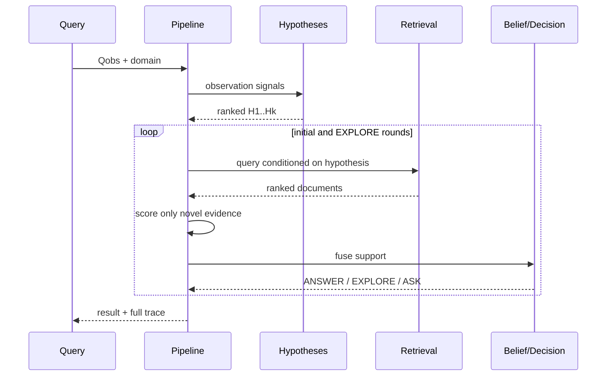

# Architecture

## Design goals

1. Make every hidden assumption inspectable.
2. Run offline with deterministic outputs and no API key.
3. Separate the scientific mechanism from replaceable retrieval or generation
   providers.
4. Make leakage, duplicate evidence, forced answers, and unfavorable outcomes
   visible rather than silently hiding them.

## Runtime sequence

## Component map

| Package | Responsibility | Replaceable boundary |
|---|---|---|
| `signals` | Normalize query; emit tokens, entities, bigrams, and quality estimate | Add language-aware NER or learned signal encoder |
| `hypotheses` | Produce explicit candidate intents | Catalog Mode A or injected dynamic Mode B |
| `retrieval` | Retrieve documents | BM25, hashing proxy, hybrid, future neural retriever |
| `evidence` | Measure support of a document for a candidate | Replace feature score with calibrated entailment model |
| `belief` | Fuse relative novel support | Replace with Bayesian or learned calibrated updater |
| `decision` | Gate answers and account for action utilities | Domain-specific costs and calibration |
| `gate` | Cheap deterministic FAST / QUASAR / DEFER_EARLY route (Milestone A) | Thresholds are a feature flag, not a sealed result |
| `analysis` | Matched FAST vs QUASAR four-way decomposition (Milestone A1) | Exploratory; no sealed-test fitting |
| `failures` | First-class failure taxonomy including OVERTHINKING/RESCUE | Labels are descriptive |
| `audit` | RepositoryStateManifest structural validation | Does not rewrite historical claims |
| `sources` | Typed SourceRegistry + offline JWST/CERN/INSPIRE metadata fixtures | Live APIs remain opt-in |
| `exploration` | Contrast top hypotheses and issue follow-up search | Expected-value or active-learning planner |
| `telemetry` | Serialize every state transition | Event sink, observability platform, or experiment store |

## State contracts

### Observation

`Observation` contains only data derived from the query and caller metadata. It
never contains `correct_hypothesis`.

### HypothesisCandidate

A candidate contains an explicit `Hypothesis`, generation score, rank, and human-
readable rationale. The catalog records anchors, aliases, and discriminator terms.

### EvidenceItem

Each item records its document, candidate, query, round, retrieval rank, four
feature scores, foreign-document flag, and final support. Its stable identity is
the candidate-document pair.

### BeliefState

The state stores logits and normalized probabilities, entropy, leading
hypothesis, confidence, and margin. `noUpdate` freezes this state after candidate
generation.

### Decision

The result records all three utilities even when a gate, rather than the largest
raw utility, determines the action. This prevents a threshold from becoming an
invisible rule.

## Evidence novelty and anti-confirmation design

Hypothesis-guided retrieval risks becoming self-confirming: adding a candidate's
name to a query can retrieve a document about that candidate. QUASAR2 limits this
problem in four ways:

1. support includes coverage of the **original observation**, not just the guided
   retrieval query;
2. corpus labels do not directly select a hypothesis;
3. the same `(hypothesis, document)` pair can update belief only once;
4. core and discriminative documents are separate, so exploration must retrieve
   a new item to change belief.

The current foreign-document penalty still uses corpus relevance labels. Set it
to zero to test a fully label-agnostic scorer; a real study should report that
sensitivity explicitly.

## Termination

The loop terminates when:

- answer confidence, margin, and evidence gates all pass;
- exploration is exhausted and ASK is enabled;
- ASK is ablated and the system is forced to answer.
- a proposed hypothesis-conditioned query repeats an issued query;
- an executed exploration round yields zero novel evidence and another
  exploration would otherwise be selected.

`max_explore_rounds` remains the hard budget. v0.1.1 adds query-history and
zero-novelty gates before that budget is exhausted, while preserving the v0.1
confidence, evidence, utility, and ASK/ANSWER rules.
