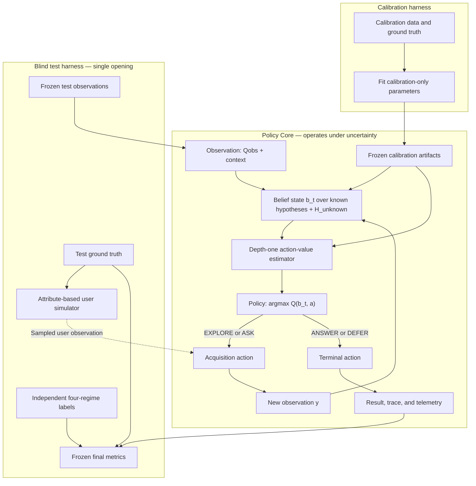

# QUASAR2 v0.2 Experimental Protocol

**Status:** frozen pre-implementation specification  
**Protocol version:** 0.2.0-protocol1  
**Date frozen:** 2026-08-25  
**Author:** Crizan Belém Ribeiro  
**Relationship to v0.1:** v0.1 remains the frozen structural and heuristic baseline.

> QUASAR2 investigates latent-intent recovery as sequential, cost-sensitive
> information acquisition over corpus evidence, user interaction, and explicit
> open-set uncertainty.

This document defines the hypotheses, decision problem, experimental regimes,
controls, metrics, calibration boundaries, and falsification criteria for
QUASAR2 v0.2. It is a protocol, not a statement that the proposed policy is
superior. Implementation begins only after this specification is frozen.

## 1. Research question

Given a noisy observation of an unobserved information need, can a one-step,
receding-horizon acquisition policy choose among corpus exploration, user
interaction, answering, and deferral more efficiently than the fixed-priority
policy used by QUASAR2 v0.1?

The primary comparison is not unconstrained accuracy. It is cost under matched
risk, or risk under matched cost:

\[
\operatorname{Cost}_{v0.2}<\operatorname{Cost}_{v0.1}
\quad\text{subject to}\quad
\operatorname{Risk}_{v0.2}\leq\operatorname{Risk}_{v0.1}+\delta.
\]

The non-inferiority margin \(\delta\) must be chosen before the test partition is
opened.

### 1.1 Architecture and information boundary

No test intent, attribute, or regime label enters hypothesis generation, belief
estimation, action scoring, or policy selection. The simulator is part of the
environment: only its sampled response is observable to the policy after an
`ASK` action. Calibration artifacts are the only fitted objects allowed to
cross into the policy core during test.

## 2. Decision model

### 2.1 History and belief

At decision step \(t\), the observable history is

\[
h_t=(Q_{obs},a_{0:t-1},y_{1:t},E_{1:t}),
\]

where \(Q_{obs}\) is the original query, \(a\) are earlier actions, \(y\) are
their observations, and \(E\) is accumulated evidence.

The belief state is the sufficient statistic

\[
b_t(I)=P(I\mid h_t),
\]

defined over

\[
\mathcal H'=\mathcal H\cup\{H_{unknown}\}.
\]

The v0.2 implementation must not describe this belief as a calibrated posterior
until held-out calibration has been completed and evaluated.

### 2.2 Actions

The action space is

\[
a_t\in\{
EXPLORE(q_E),ASK(q_A),ANSWER(H_i),DEFER
\}.
\]

- `EXPLORE(q_E)` spends retrieval resources and returns corpus observation
  \(Y_E\).
- `ASK(q_A)` spends interaction cost and returns user observation \(Y_A\).
- `ANSWER(H_i)` terminates with hypothesis \(H_i\).
- `DEFER` terminates without committing to an in-catalog hypothesis.

`ANSWER` and `DEFER` are terminal actions. `EXPLORE` and `ASK` are acquisition
actions and produce a belief transition

\[
b_{t+1}=\tau(b_t,a_t,y_{t+1}).
\]

### 2.3 Conditional information gain

For an acquisition action, expected information gain is

\[
IG(a_t)=I(I;Y_{t+1}\mid h_t,a_t)
\]

\[
=H(b_t)-
\mathbb E_{y\sim P(y\mid b_t,a_t)}
[H(\tau(b_t,a_t,y))].
\]

Corpus-resolvable, interaction-resolvable, and open-set uncertainty are not
assumed to form an additive entropy decomposition. Their observations may be
correlated, overlapping, redundant, or conditionally uninformative.

### 2.4 Receding-horizon policy with depth one

Depth \(d=1\) is evaluated at every decision step; it does not mean that the
episode has only one step.

For acquisition actions:

\[
Q_t(b_t,a)=
-C(a)+\gamma
\mathbb E_{y\sim P(y\mid b_t,a)}
[V_{terminal}(\tau(b_t,a,y))].
\]

The terminal value is

\[
V_{terminal}(b')=
\max\left(
\max_i Q(b',ANSWER(H_i)),
Q(b',DEFER)
\right).
\]

Terminal utilities are

\[
Q(b,ANSWER(H_i))=
R_{correct}\,b(H_i)-C_{wrong}[1-b(H_i)]
\]

and

\[
Q(b,DEFER)=-C_D.
\]

The policy compares terminal and acquisition actions directly:

\[
\pi_{d=1}(b_t)=
\arg\max_{a\in\mathcal A}Q_t(b_t,a).
\]

There is no structural precedence of `EXPLORE` over `ASK` in v0.2.

## 3. Four experimental regimes

| Regime | Catalog | Corpus | Retriever | Rational target action |
|---|---|---|---|---|
| Retrieval failure | Contains the intent | Contains relevant evidence | Fails because of query/index behavior | `EXPLORE` with a different query or retriever |
| Known intent with missing corpus | Contains the intent | Relevant evidence is absent | Cannot retrieve absent evidence | `ASK` if the user can supply the missing attribute; otherwise `DEFER` |
| In-catalog ambiguity | Contains multiple plausible hypotheses | Contains partial or overlapping evidence | Operates normally | Direct competition between `EXPLORE` and `ASK` |
| True open set | Does not contain the intent | Variable or irrelevant | Retrieval success is not decisive | `DEFER` through explicit unknown probability |

These regimes must be labeled independently in the evaluation fixture. Low
retrieval score alone must not be used as a ground-truth open-set label.

### 3.1 Required regime construction

1. **Retrieval failure:** retain relevant documents, then induce query mismatch,
   index perturbation, retriever ablation, or top-k truncation.
2. **Missing corpus:** remove every document carrying the information necessary
   to distinguish the known intent while retaining the catalog entry.
3. **In-catalog ambiguity:** construct observations compatible with at least two
   catalog hypotheses and annotate the missing discriminative attributes.
4. **True open set:** use both leave-one-intent-out near-OOD cases and genuinely
   external out-of-domain intents never used to author the catalog.

## 4. Open-set model

The belief space contains explicit \(H_{unknown}\). The estimator may use:

- catalog coverage;
- calibrated distance or density under the hypothesis representation;
- strength and contradiction of evidence across all known hypotheses;
- instability under controlled query perturbations;
- disagreement among compatible retrievers;
- conformal nonconformity scores.

No individual feature is sufficient evidence of open set. In particular,
retriever disagreement may indicate retriever weakness, and embedding-centroid
distance may be unreliable in high-dimensional space.

Evaluation must distinguish:

- unknown intent;
- known intent with missing evidence;
- ambiguous known intent;
- retrieval failure.

Primary open-set measures are false-accept rate, false-defer rate, macro-F1 over
the four regimes, risk-coverage behavior, and calibration of the unknown score.

## 5. User-response simulator

### 5.1 Purpose

The first evaluation of `ASK` uses an attribute-based simulator rather than an
LLM-as-user. This prevents circularity between a generative policy and a
generative evaluator.

Each intent has annotated slots and permissible clarification questions. For a
question \(q_A\), the simulator samples

\[
Y_A\sim P(y_A\mid I,q_A).
\]

### 5.2 Outcome distribution

Let

\[
\epsilon_{wrong}+\epsilon_{vague}+\epsilon_{unknown}
+\epsilon_{abandon}\leq1.
\]

Then the response distribution is:

\[
Y_A=\begin{cases}
\text{correct annotated attribute},
&1-\sum_j\epsilon_j,\\
\text{attribute from an incompatible intent},
&\epsilon_{wrong},\\
\text{ambiguous value or superclass},
&\epsilon_{vague},\\
\text{``unknown'' / no information},
&\epsilon_{unknown},\\
\text{session termination},
&\epsilon_{abandon}.
\end{cases}
\]

The simulator configuration must record all probabilities, random seed, slot
schema, question id, true intent, sampled response, and resulting belief update.

### 5.3 Noise and cost grid

The benchmark varies at least:

- wrong-answer probability;
- vague-answer probability;
- “I do not know” probability;
- abandonment probability;
- cognitive/latency cost \(C_A\).

Results must show where `ASK` ceases to have positive net value. A human
interactive study is required before interpreting synthetic interaction cost as
real user burden.

## 6. Hypotheses and falsification criteria

### H1 — competitive policy

The depth-one policy reduces expected cost relative to the fixed-priority v0.1
policy while remaining within the preregistered paired-risk margin \(\delta\).

**Falsified in the tested regime if:** the upper paired confidence bound exceeds
the risk margin, or cost reduction is non-positive after matching risk.

### H2 — selective ASK

`ASK` is selected over `EXPLORE` when corpus information gain is negligible and
the expected user response has positive net value. Performance degrades
gracefully as user noise or cost increases.

**Falsified if:** the policy cannot outperform always-explore or always-ask on
the risk-cost frontier across the preregistered noise grid.

### H3 — explicit open set

Explicit \(P(H_{unknown})\) reduces false acceptance of unknown queries relative
to closed-set normalization without an unacceptable increase in false deferral
on known queries.

**Falsified if:** no operating threshold improves the preregistered FAR/FDR
trade-off over the closed-set control.

### H4 — multi-regime diagnosis

A four-regime diagnostic model separates retrieval failure, missing corpus,
in-catalog ambiguity, and true open set better than a binary OOD detector.

**Falsified if:** paired macro-F1 and per-regime calibration do not improve, or
if gains arise solely from experimental artifacts that reveal the regime label.

### H5 — redundancy pruning

Query-history and zero-novelty gates reduce empty retrieval calls without a
practically meaningful loss in intent recovery or correct autonomous resolution.

**Falsified if:** savings are non-positive or the lower quality bound exceeds
the preregistered non-inferiority margin.

## 7. Controls and upper bounds

All methods use identical data partitions, corpus snapshots, candidate budgets,
and recorded cost definitions.

1. `v0.1-static`: fixed `EXPLORE` precedence.
2. `v0.1.1-pruned`: v0.1 plus repeated-query and zero-novelty termination.
3. `always-answer`: immediate greedy commitment.
4. `always-explore`: acquisition until the exploration budget is exhausted.
5. `always-ask`: immediate clarification whenever a valid question exists.
6. `no-defer`: forced closed-set decision.
7. `action-oracle`: uses future outcomes to choose the best action.

The action oracle is an unattainable upper bound, not a deployable baseline.
Results must not describe oracle performance as achievable.

## 8. Costs and primary outcomes

The cost ledger records, at minimum:

- retrieval calls;
- retrieved documents and reranked pairs;
- tokens or equivalent compute units;
- wall-clock latency;
- user questions;
- abandonment;
- wrong autonomous answers;
- deferrals.

Primary analysis uses the Pareto surface over:

1. decision risk;
2. acquisition cost;
3. autonomous coverage;
4. deferral/abstention.

Do not collapse these dimensions into a single quality/cost ratio as the only
reported endpoint. Required summaries include:

- risk at matched cost;
- cost at matched risk;
- correct autonomous resolution rate;
- wrong autonomous resolution rate;
- risk-coverage and cost-coverage curves;
- Pareto dominance and hypervolume with a preregistered reference point;
- action frequencies by regime;
- empty and duplicate acquisition calls.

## 9. Calibration

Train, calibration, validation, and test roles are frozen separately.

- Training fits learned components only.
- Calibration fits belief calibration, unknown thresholds, conformal scores, and
  action-cost coefficients.
- Validation selects model families and operating regions.
- Test is opened once for the frozen comparison.

### 9.1 Frozen artifacts and single-open test policy

Before test observations are opened, the following artifacts are serialized,
versioned, and hashed:

- belief calibrator and its model family;
- observation models \(P(y\mid b,a)\) for acquisition actions;
- unknown-intent detector and operating threshold;
- normalized retrieval, interaction, wrong-answer, and deferral costs;
- conformal calibration parameters, when used;
- operational thresholds and action-generator version;
- user-simulator schema, parameters, implementation version, and seeds.

The blind test is executed exactly once per frozen manifest. An unfavorable
scientific result remains valid and is reported. A confirmed implementation bug
invalidates—but never deletes—the run; its metadata, output hashes, reason, and
replacement manifest remain in the repository. No post-test threshold change is
allowed. Any change creates a new calibration cycle and a new test manifest,
which is reported as a separate experiment rather than silently replacing the
first run.

Candidate calibration methods include temperature scaling, vector scaling, and
Dirichlet calibration. Conformal methods may produce hypothesis sets or
selective-risk guarantees. Isotonic one-vs-rest outputs must not be interpreted
as a normalized multiclass distribution without an additional reconciliation
step.

Required diagnostics:

- Brier score;
- log loss;
- expected calibration error with bin sensitivity;
- reliability diagrams;
- classwise and unknown calibration;
- conformal coverage and set size when applicable;
- selective risk-coverage curves.

## 10. Statistical analysis

Every method is evaluated on paired `(intent, condition, degradation seed)`
units. Failed and unfavorable runs are retained.

The primary effect analysis uses paired bootstrap confidence intervals and a
generalized mixed-effects model suitable for binary outcomes:

\[
Correct\sim Method\times Regime\times Severity
+(1\mid Intent)+(1\mid Seed)+(1\mid Domain).
\]

Cost and latency require distributions appropriate to their skew and zero
inflation. Multiple primary comparisons and the smallest effect size of interest
must be preregistered. Statistical significance without practical effect size is
not sufficient.

The number of intents is determined by power or interval-width analysis. “100
per domain” is a target scale, not a substitute for power calculation. At least
30 retained degradation seeds are required for a multi-seed robustness claim.

## 11. Leakage and reproducibility controls

- Freeze and hash corpus, catalog, intent, slot, and question manifests.
- Do not expose test intent labels to hypothesis generation or action selection.
- Do not tune catalog language against test queries.
- Keep user-simulator parameters outside method-specific tuning.
- Record all random seeds and environment versions.
- Cache stochastic external outputs if a later experiment introduces an LLM.
- Publish query-level results, including failures and deferrals.
- Version all cost functions and threshold changes.

## 12. Implementation sequence

### v0.1.1 prerequisite

**Implementation status:** complete in v0.1.1; see
[`V0.1.1_REDUNDANCY_PRUNING.md`](V0.1.1_REDUNDANCY_PRUNING.md).

1. Hash and retain every issued acquisition query.
2. Reject identical repeated queries.
3. Stop or reroute when novel evidence yield is zero.
4. Report avoided calls and any quality change.

### v0.2 mechanism

1. Add `H_unknown` to typed belief state.
2. Add explicit `DEFER` terminal action.
3. Define candidate `EXPLORE` and `ASK` action generators.
4. Implement empirical observation models on calibration data.
5. Implement one-step action-value estimation.
6. Select the unrestricted argmax across acquisition and terminal actions.
7. Add the four-regime fixture and attribute-based user simulator.
8. Add cost ledger, calibration, Pareto analysis, and paired statistics.

MCTS, RL, and long-horizon planning are explicitly out of scope for v0.2.

## 13. Acceptance gates before opening the test set

- [ ] Protocol, hypotheses, margins, primary metrics, and cost definitions frozen.
- [ ] Four regimes validated without label leakage.
- [ ] Simulator probabilities form a valid simplex and are versioned.
- [ ] All controls execute on identical paired units.
- [ ] Calibration and validation partitions remain distinct from test.
- [x] Empty/repeated exploration calls are measured in the v0.1.1 prerequisite.
- [ ] Unknown-intent and missing-corpus cases are distinguishable in the fixture.
- [ ] Oracle is labeled exclusively as an upper bound.
- [ ] Power or interval-width analysis is complete.
- [ ] Test manifest hash is recorded before results are observed.

## 14. Claim boundary

The protocol permits the claim that QUASAR2 *investigates* cost-sensitive active
intent recovery. It does not establish that the method is novel, optimal,
Bayesian-calibrated, generally superior, or production ready.

A stronger claim requires favorable held-out results, sensitivity analysis,
external validity, and a systematic review of interactive IR, clarification
question generation, value of information, active search, selective prediction,
conformal prediction, open-set recognition, POMDP retrieval, and information
foraging literature.

## 15. Frozen synthesis

QUASAR2 v0.2 tests whether a transparent one-step policy can choose when to
answer, search, ask, or defer by estimating the expected value of information
from heterogeneous sources. The experiment succeeds only if it identifies the
regimes in which this policy wins, ties, loses, or declines to act—and reports
all four outcomes without overclaiming.
