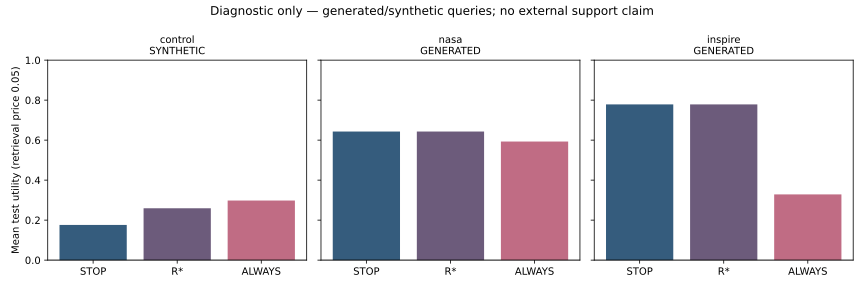

# Frozen diagnostic results

All rows use the preregistered retrieval price 0.05. Values are rounded here;
[full precision reports](../experiments/v03/reports/results.json) and
[checksummed run archives](../experiments/v03/manifests/published_runs.json)
contain the underlying predictions, models and provenance.

| Input | Test queries / groups | R* extra calls | STOP utility | R* utility | ALWAYS utility |
|---|---:|---:|---:|---:|---:|
| Synthetic control | 93 / 93 | 5 | .1758 | .2591 | .2978 |
| NASA, generated queries | 202 / 58 | 0 | .6431 | .6431 | .5931 |
| INSPIRE, generated queries | 35 / 35 | 0 | .7786 | .7786 | .3286 |

For the synthetic control, R* minus entropy at the same five-call quota is .0860,
97.5% cluster-bootstrap interval [.0024, .1936]. Against the mean of five
exact-quota random policies it is .0817 [.0063, .1778]. Neither lower bound exceeds
the preregistered minimum meaningful effect .01. These are synthetic findings;
ALWAYS also has greater utility when unconstrained by that quota.

On both real-source/generated-query datasets, development tuning selects STOP.
All exact-quota baselines therefore make zero extra calls, giving identical
utilities and degenerate [0, 0] difference intervals. This cannot establish gate
superiority. ALWAYS is worse, especially for INSPIRE, where cached fusion with the
hashing proxy reduces top-1 relevance. That is a negative result for indiscriminate
extra retrieval in this particular setup, not a universal result about exploration.

No claim is marked SUPPORTED. Native external questions, independent annotations,
strong models, transfer and scale remain necessary. The source manifest records
bounded acquisitions; neither NASA nor INSPIRE is represented as a complete corpus.
